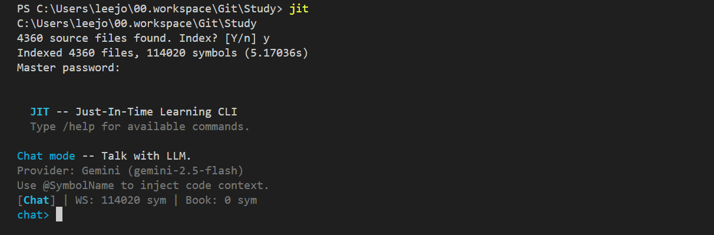
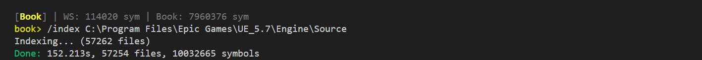
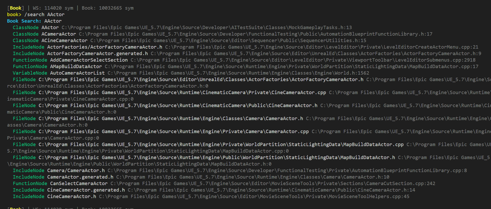
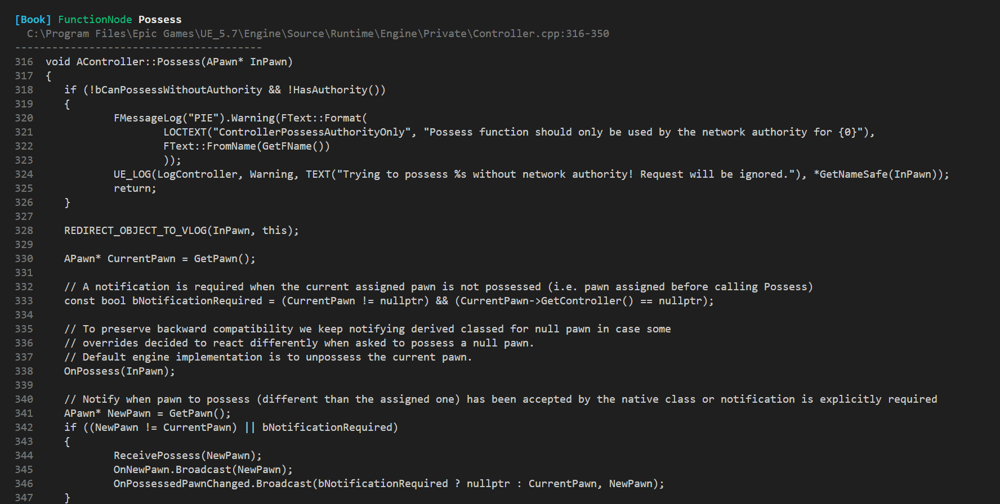
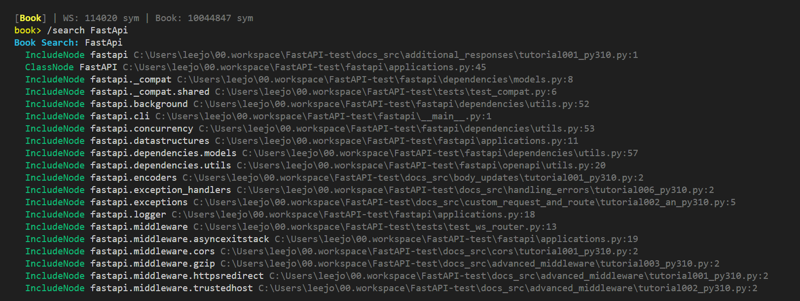

# JIT CLI

**C++ in-memory code graph engine + LLM chat CLI**

> [English](#english) | [한국어](#한국어)

---

# English

## What it does

JIT indexes your codebase into an in-memory symbol graph, then lets you chat with an LLM using precise code context. No hallucination — the LLM only sees what you inject.

Any codebase, indexed in seconds. Symbol queries in microseconds. No database, no server — just a single binary.



## Benchmarks

| Codebase | Files | Symbols | Index Time |
|----------|-------|---------|------------|
| FastAPI | 1,119 | 12,182 | 12.8s |
| Unreal Engine 5.7 | 57,254 | 10,032,665 | 152s |
| Linux Kernel | 63,451 | 7,960,376 | 85s |

## Screenshots

### Book Mode — Index any codebase as reference



### Symbol Search — Find symbols across millions of entries



### Open Code — View full source code of any symbol



### Python Support — Index and search Python codebases



## Tech Stack

- **Language**: C++20
- **Parser**: tree-sitter (C, C++, Python)
- **Architecture**: DOD (Data-Oriented Design) — SOA arrays, StringPool interning, zero heap allocation per symbol
- **Indexing**: Multi-threaded parallel parsing with batch preprocessing
- **Query**: Bidirectional BFS on in-memory graph (SmartQuery)
- **LLM**: Claude, Gemini, Ollama (streaming)
- **Security**: libsodium (Argon2id KDF + XSalsa20-Poly1305) for API key encryption
- **Dependencies**: tree-sitter, libsodium, libgit2, libcurl, nlohmann/json

## Install

Download the latest binary from [Releases](https://github.com/leejongha45-beep/jit-cli/releases).

| Platform | Architecture | File |
|----------|-------------|------|
| Windows | x64 | `jit.exe` |
| macOS | arm64 (Apple Silicon) | `jit-macos-arm64` |

### Windows
```
jit.exe [path]
```

### macOS
```bash
chmod +x jit-macos-arm64
./jit-macos-arm64 [path]
```

If no path is given, JIT uses the current working directory.

## Supported Languages

| Language | Extensions |
|----------|-----------|
| C | `.c` |
| C++ | `.cpp`, `.hpp`, `.h`, `.cc`, `.cxx` |
| Python | `.py` |

## Commands

### Global Commands

Available in all modes.

| Command | Description |
|---------|-------------|
| `/chat` | Switch to Chat mode |
| `/query` | Switch to Query mode |
| `/book` | Switch to Book mode |
| `/searchws <name>` | Search workspace symbols |
| `/searchbook <name>` | Search book symbols |
| `/symws <name>` | Show symbol graph (members, edges) |
| `/symbook <name>` | Show book symbol graph |
| `/opencode <name>` | Show full source code of a symbol |
| `/patch <file>` | Apply LLM-suggested code edits to a file |
| `/config` | Configure LLM provider and API key |
| `/rc` | Clear symbol cart |
| `/help` | Show help |
| `/quit` | Quit |

### Chat Mode

Talk with an LLM using symbol context injection.

```
chat> @FastAPI explain the middleware stack
[1 symbol context(s) injected]

assistant: Based on the FastAPI class definition...
```

- Type `@SymbolName` in your message to inject that symbol's code context
- Symbols loaded via `/finish` in Query/Book mode are auto-injected on every message

### Query Mode — `/query`

Explore the in-memory symbol graph.

| Command | Description |
|---------|-------------|
| `<name>` | Quick search symbols |
| `/smart <name>` | Bidirectional BFS query (forward + reverse edges) |
| `/tree [name]` | Show symbol tree |
| `/symbols <name>` | List all symbols matching name |
| `/search <name>` | Search and display results |
| `/choose <number>` | Add symbol to cart by result number |
| `/remove <number>` | Remove symbol from cart |
| `/finish` | Send cart to Chat mode |

### Book Mode — `/book`

Index external codebases (local cloned repos or local paths) as reference material.

| Command | Description |
|---------|-------------|
| `/index <local-path>` | Index a local codebase as book |
| `/search <name>` | Search book symbols |
| `/choose <number>` | Add to cart |
| `/remove <number>` | Remove from cart |
| `/removebook <path>` | Remove an indexed book |
| `/finish` | Send cart to Chat mode |

## LLM Configuration

> **Minimum recommended models**: Gemini Flash or Claude Sonnet and above.
> Small context models may not perform well even with symbol injection — the injected context requires sufficient context window size for accurate code generation.

On first run, configure your LLM provider:

```
/config
```

Supported providers:
- **Claude** (Anthropic) — requires `ANTHROPIC_API_KEY` (Sonnet or above recommended)
- **Gemini** (Google) — requires `GEMINI_API_KEY` (Flash or above recommended)
- **Ollama** (Local) — no key needed, runs locally (use 7B+ parameter models)

API keys are encrypted at rest with libsodium and protected by a master password.

## Workflow

```
1. Start — Index your workspace
   $ jit /my/project
   4360 source files found. Index? [Y/n]

2. Configure — Set up LLM provider (first time only)
   /config

3. Chat — Talk with LLM using @symbol context injection
   chat> @MyClass refactor this class

4. Query — Explore symbol graph + review code + select
   /query
     → /search MyClass            (find symbols)
     → /opencode MyClass          (review source code)
     → /choose 1                  (add to cart)
     → /smart MyClass             (BFS — discover related symbols)
     → /opencode Dependency       (review dependency code)
     → /choose 3                  (select what you need)
     → /finish                    (send to Chat)

5. Book — Index external codebases as reference
   /book
     → /index /path/to/reference  (index external codebase)
     → /search AActor             (find symbols)
     → /opencode AActor           (review reference code)
     → /choose 1                  (select)
     → /finish                    (send to Chat)

6. Verify — Double-check LLM output against real code
   chat> LLM suggests calling Init()...
     → /opencode Init             (is that actually how it works?)
     → confirm or correct

7. Patch — Apply LLM-generated code directly to file
   /patch myfile.cpp
```

## How It Works

```
Source Files → tree-sitter Parse → Symbol Graph (in-memory)
                                        ↓
                              SmartQuery (bidirectional BFS)
                                        ↓
                              Symbol Context Injection
                                        ↓
                                   LLM Chat
```

1. **Index**: tree-sitter parses source files into POD symbols (Function, Class, Variable, Include) with relationship edges (DefinedIn, MemberOf, Calls, Inherits, Returns)
2. **Query**: SmartQuery runs bidirectional BFS — forward edges find what a symbol uses, reverse edges find what uses it
3. **Inject**: `@SymbolName` in chat injects the symbol's metadata as context
4. **Generate**: LLM generates code based only on the provided symbol context — no guessing, no hallucination

---

# 한국어

## 소개

JIT는 코드베이스를 인메모리 심볼 그래프로 인덱싱한 뒤, 정확한 코드 컨텍스트를 주입하여 LLM과 대화합니다. LLM은 주입된 심볼만 보기 때문에 할루시네이션이 없습니다.

코드베이스를 초 단위로 인덱싱하고, 마이크로초 단위로 심볼을 검색합니다. DB 없이, 서버 없이 — 바이너리 하나로 동작합니다.


## 벤치마크

| 코드베이스 | 파일 수 | 심볼 수 | 인덱싱 시간 |
|----------|-------|---------|------------|
| FastAPI | 1,119 | 12,182 | 12.8초 |
| Unreal Engine 5.7 | 57,254 | 10,032,665 | 152초 |
| Linux Kernel | 63,451 | 7,960,376 | 85초 |

## 스크린샷

### 교재 모드 — 외부 코드베이스를 참고 교재로 인덱싱


### 심볼 검색 — 수백만 심볼에서 즉시 검색


### 소스코드 열기 — 심볼의 전체 소스코드 표시


### Python 지원 — Python 코드베이스 인덱싱 및 검색


## 기술 스택

- **언어**: C++20
- **파서**: tree-sitter (C, C++, Python)
- **아키텍처**: DOD (Data-Oriented Design) — SOA 연속 배열, StringPool 인터닝, 심볼당 힙 할당 0
- **인덱싱**: 멀티스레드 병렬 파싱 + 배치 전처리
- **쿼리**: 인메모리 그래프 양방향 BFS (SmartQuery)
- **LLM**: Claude, Gemini, Ollama (스트리밍)
- **보안**: libsodium (Argon2id KDF + XSalsa20-Poly1305) API 키 암호화
- **의존성**: tree-sitter, libsodium, libgit2, libcurl, nlohmann/json

## 설치

[Releases](https://github.com/leejongha45-beep/jit-cli/releases) 페이지에서 OS에 맞는 바이너리를 다운로드하세요.

| 플랫폼 | 아키텍처 | 파일 |
|--------|---------|------|
| Windows | x64 | `jit.exe` |
| macOS | arm64 (Apple Silicon) | `jit-macos-arm64` |

### Windows
```
jit.exe [경로]
```

### macOS
```bash
chmod +x jit-macos-arm64
./jit-macos-arm64 [경로]
```

경로를 생략하면 현재 작업 디렉토리를 사용합니다.

## 지원 언어

| 언어 | 확장자 |
|------|--------|
| C | `.c` |
| C++ | `.cpp`, `.hpp`, `.h`, `.cc`, `.cxx` |
| Python | `.py` |

## 명령어

### 전역 명령어

모든 모드에서 사용 가능합니다.

| 명령어 | 설명 |
|--------|------|
| `/chat` | Chat 모드로 전환 |
| `/query` | Query 모드로 전환 |
| `/book` | Book 모드로 전환 |
| `/searchws <이름>` | 워크스페이스 심볼 검색 |
| `/searchbook <이름>` | 교재 심볼 검색 |
| `/symws <이름>` | 심볼 그래프 표시 (멤버, 엣지) |
| `/symbook <이름>` | 교재 심볼 그래프 표시 |
| `/opencode <이름>` | 심볼의 전체 소스코드 표시 |
| `/patch <파일>` | LLM이 제시한 코드를 파일에 적용 |
| `/config` | LLM 프로바이더/API 키 설정 |
| `/rc` | 심볼 카트 비우기 |
| `/help` | 도움말 |
| `/quit` | 종료 |

### 채팅 모드

LLM과 대화하면서 심볼 컨텍스트를 주입합니다.

```
chat> @FastAPI 미들웨어 스택 설명해줘
[1 symbol context(s) injected]

assistant: FastAPI 클래스 정의를 기반으로...
```

- `@심볼이름`을 메시지에 입력하면 해당 심볼의 코드 컨텍스트가 주입됩니다
- Query/Book 모드에서 `/finish`로 카트에 담은 심볼은 매 메시지마다 자동 주입됩니다

### 쿼리 모드 — `/query`

인메모리 심볼 그래프를 탐색합니다.

| 명령어 | 설명 |
|--------|------|
| `<이름>` | 심볼 빠른 검색 |
| `/smart <이름>` | 양방향 BFS 쿼리 (순방향 + 역방향 엣지) |
| `/tree [이름]` | 심볼 트리 표시 |
| `/symbols <이름>` | 이름으로 심볼 목록 |
| `/search <이름>` | 검색 결과 표시 |
| `/choose <번호>` | 결과 번호로 카트에 추가 |
| `/remove <번호>` | 카트에서 제거 |
| `/finish` | 카트를 Chat 모드로 전송 |

### 교재 모드 — `/book`

외부 코드베이스(로컬에 클론된 저장소 또는 로컬 경로)를 참고 교재로 인덱싱합니다.

| 명령어 | 설명 |
|--------|------|
| `/index <로컬경로>` | 로컬 경로의 코드베이스를 교재로 인덱싱 |
| `/search <이름>` | 교재 심볼 검색 |
| `/choose <번호>` | 카트에 추가 |
| `/remove <번호>` | 카트에서 제거 |
| `/removebook <경로>` | 인덱싱된 교재 제거 |
| `/finish` | 카트를 Chat 모드로 전송 |

## LLM 설정

> **최소 권장 모델**: Gemini Flash 또는 Claude Sonnet 이상.
> 컨텍스트 크기가 작은 소형 모델은 심볼을 주입해도 컨텍스트 용량이 부족하여 코드 생성 품질이 떨어질 수 있습니다.

최초 실행 시 LLM 프로바이더를 설정하세요:

```
/config
```

지원 프로바이더:
- **Claude** (Anthropic) — `ANTHROPIC_API_KEY` 필요 (Sonnet 이상 권장)
- **Gemini** (Google) — `GEMINI_API_KEY` 필요 (Flash 이상 권장)
- **Ollama** (로컬) — 키 불필요, 로컬 실행 (7B+ 파라미터 모델 권장)

API 키는 libsodium으로 암호화되어 저장되며, 마스터 비밀번호로 보호됩니다.

## 워크플로우

```
1. 시작 — 워크스페이스 인덱싱
   $ jit /my/project
   4360 source files found. Index? [Y/n]

2. 설정 — LLM 프로바이더 설정 (최초 1회)
   /config

3. 채팅 — @심볼로 코드 컨텍스트 주입하며 대화
   chat> @MyClass 이 클래스 리팩토링해줘

4. 쿼리 — 심볼 그래프 탐색 + 코드 확인 + 선택
   /query
     → /search MyClass            (심볼 검색)
     → /opencode MyClass          (소스코드 확인)
     → /choose 1                  (카트에 추가)
     → /smart MyClass             (BFS — 관련 심볼 탐색)
     → /opencode Dependency       (의존 심볼 코드 확인)
     → /choose 3                  (필요한 것만 선택)
     → /finish                    (Chat으로 전송)

5. 교재 — 외부 코드베이스를 참고 교재로 추가
   /book
     → /index /path/to/reference  (외부 코드베이스 인덱싱)
     → /search AActor             (심볼 검색)
     → /opencode AActor           (레퍼런스 코드 확인)
     → /choose 1                  (선택)
     → /finish                    (Chat으로 전송)

6. 검증 — LLM 출력이 의심될 때 실제 코드로 확인
   chat> LLM이 Init() 호출을 제안...
     → /opencode Init             (실제로 그렇게 동작하나?)
     → 확인 후 수정 또는 채택

7. 패치 — LLM 생성 코드를 파일에 바로 적용
   /patch myfile.cpp
```

## 동작 원리

```
소스 파일 → tree-sitter 파싱 → 심볼 그래프 (인메모리)
                                      ↓
                            SmartQuery (양방향 BFS)
                                      ↓
                            심볼 컨텍스트 주입
                                      ↓
                                 LLM 채팅
```

1. **인덱싱**: tree-sitter로 소스 파일을 POD 심볼(Function, Class, Variable, Include)과 관계 엣지(DefinedIn, MemberOf, Calls, Inherits, Returns)로 파싱
2. **쿼리**: SmartQuery가 그래프에서 양방향 BFS 실행 — 순방향은 심볼이 사용하는 것, 역방향은 심볼을 사용하는 것을 탐색
3. **주입**: 채팅에서 `@심볼이름` 입력 시 해당 심볼의 메타데이터를 컨텍스트로 주입
4. **생성**: LLM은 주입된 심볼 컨텍스트만을 기반으로 코드 생성 — 추측 없음, 할루시네이션 없음

---

## License

All rights reserved.
